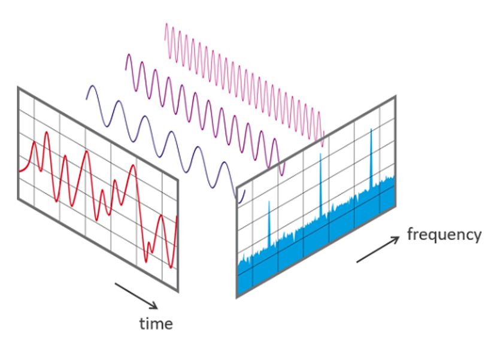
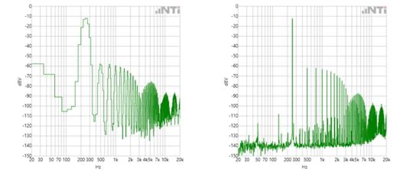
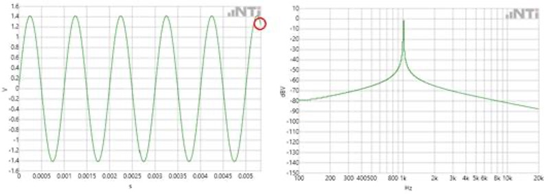
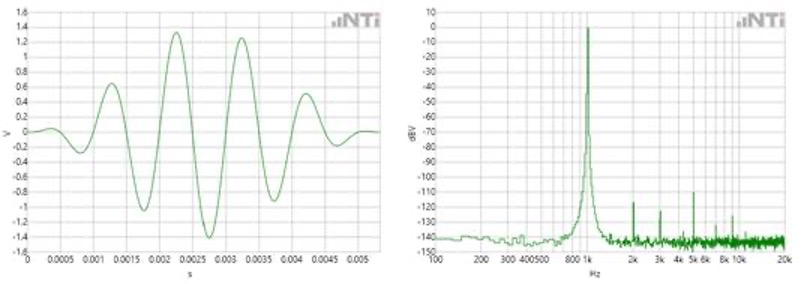
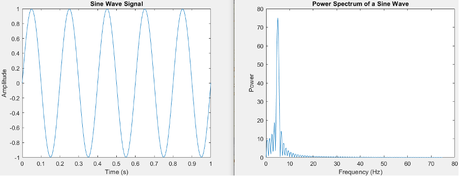
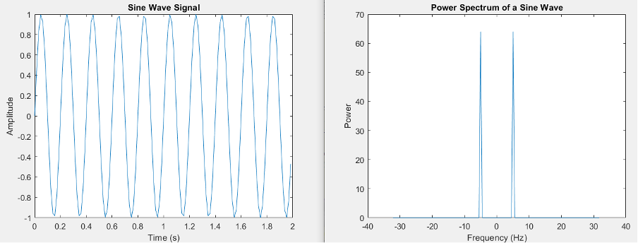
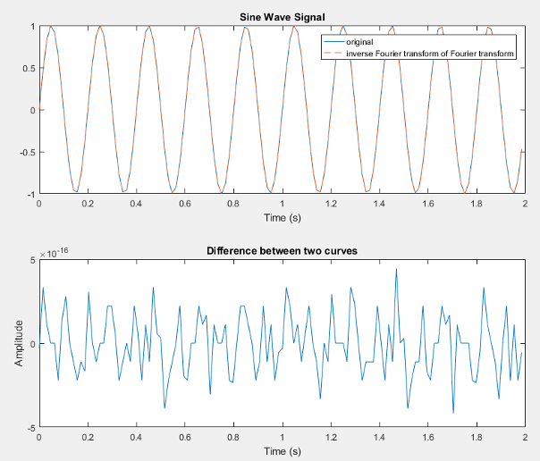
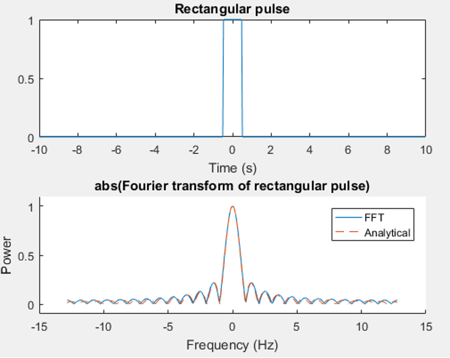

# Doing and Understanding Fourier Transforms

As physicists, we're used to observing and modeling oscillations, thinking in terms of normal modes, etc.
In this tutorial we will see how this way of thinking can be operationalized as a Fourier Transform.

In the context of your physiological measurements, it will be crucial to boost your signal by manipulating your input time-series data in the frequency domain (e.g., filtering out ranges of frequencies associated with 'noise').

#### A Friendly Introduction (External Resources)

Take a read/watch over the following before moving onto the rest of this tutorial:
* An excellent introduction to Fourier Transforms is [this website](http://www.jezzamon.com/fourier/index.html).
* Another accessible intro but with a bit more maths is [this website](https://betterexplained.com/articles/an-interactive-guide-to-the-fourier-transform/).
* [This video](https://www.youtube.com/watch?v=spUNpyF58BY) is a fun one.

## A practical introduction to using the Fast Fourier Transform

The tutorial material was adapted from original material from [this website](https://www.nti-audio.com/en/support/know-how/fast-fourier-transform-fft).

### Introduction

The "Fast Fourier Transform" (FFT) is an important measurement method in the science of audio and acoustics measurement.
It converts a signal into individual spectral components and thereby provides frequency information about the signal.
FFTs are used for fault analysis, quality control, and condition monitoring of machines or systems.
This explains how an FFT works, the relevant parameters and their effects on the measurement result.
Strictly speaking, the FFT is an optimized algorithm for the implementation of the "Discrete Fourier Transformation" (DFT).
A signal is sampled over a period of time and divided into its frequency components.
These components are single sinusoidal oscillations at distinct frequencies each with their own amplitude and phase.
This transformation is illustrated in the following diagram.
Over the time period measured, the signal contains three distinct dominant frequencies.



### How it works, and some important considerations

In the first step, a section of the signal is scanned and stored in the memory for further processing.
Two parameters are relevant:

1. The sampling rate or sampling frequency, `fs`, of the measuring system (e.g., 48 kHz).
This is the average number of samples obtained in one second (samples per second).
2. The selected number of samples: the BlockLength, `BL`. This is always an integer power to the base 2 in the FFT (e.g., `2^10 = 1024` samples).

From the two basic parameters, `fs` and `BL`, further parameters of the measurement can be determined:

#### Bandwidth, `fn` (Nyquist frequency)

This value indicates the theoretical maximum frequency that can be determined by the FFT: `fn = fs/2`.

For example at a sampling rate of 48 kHz, frequency components up to 24 kHz can be theoretically determined.
In the case of an analog system, the practically achievable value is usually somewhat below this, due to analog filters - e.g., at 20 kHz.

#### Measurement duration, `D`

The measurement duration is given by the sampling rate, `fs`, and the blocklength, `BL`: `D = fs/BL`.

At `fs` = 48 kHz and `BL` = 1024, this gives a `df` of 48000 Hz / 1024 = 46.88 Hz.

---

In practice, the sampling frequency, `fs`, is usually a variable given by the system.
However, by selecting the blocklength BL, the measurement duration and frequency resolution can be defined.

The following applies:
* A small blocklength results in fast measurement repetitions with a coarse frequency resolution.
* A large blocklength results in slower measuring repetitions with fine frequency resolution.

Here is an example of the FFT of a signal with a small and large blocklength, `BL`:



### Representing infinity?

In the Fourier transformation, the assumption is that the sampled signal segment is repeated periodically for an infinite period of time.

This brings two conclusions:
1. The FFT is only suitable for periodic signals
2. The sampled signal segment must contain a whole number of periods.

Condition 2 would apply only to very few signals.
The sampling of a signal whose frequencies are not an integer multiple of df would begin and end within a block of `2^n` samples with different values.
This results in a jump in the time signal, and a "smeared" FFT spectrum (also known as 'leakage').

Here is an example of an un-windowed time signal with a smeared spectrum (note the logarithmic scale):



### Windowing

In order to prevent this smearing, a process called "windowing" can be applied to the signal sample.
Using a weighting function, the signal sample is more or less gently turned on and off.
The result is that the sampled and subsequent "windowed" signal begins and ends at amplitude zero.
The sample can now be repeated periodically without a hard transition.

Here's an example of a windowed time signal and the resulting power spectrum:



## Further Considerations

We now consider specific aspects that are helpful in the practical application of FFT measurements.
FFT measurements are used in numerous applications.
The results are usually presented as graphs and are easy to interpret.
For accurate FFT measurements, there are some things to look out for.
Here are some valuable tips:

As explained in the first part, the sampling rate `fs` of the measuring system and the block length `BL` are the two central parameters of an FFT.
The sampling rate indicates how often the analog signal to be analyzed is scanned.
When recording `.wav` files via a commercially available PC sound card, for example, the audio signal is usually sampled 44,100 times per second.

### Nyquist Theorem

Harry Nyquist was the discoverer of a fundamental rule in the sampling of analog signals: the sampling frequency must be at least double the highest frequency of the signal.
If, for example, a signal containing frequencies up to 24 kHz is to be sampled, a sampling rate of at least 48 kHz is required for this purpose.
Half the sampling rate, in this example 24 kHz, is called the "Nyquist frequency".

If signals above the Nyquist frequency are fed in to the system, we get _aliasing_.

#### Aliasing
For the most, a signal is sampled with a more-than-sufficient number of samples.
With a 48 kHz sampling rate, for example, the 6 kHz frequency is sampled 8 times per cycle, while the 12 kHz frequency is only sampled 4 times per cycle.
At the Nyquist frequency, only 2 samples are available per cycle.
With 2 samples or more it is still possible to reconstruct the signal without loss.
If, however, less than 2 samples are available, artifacts which do not occur in the sampled (original) signal are generated.

#### Mirror frequencies

In the FFT, these artifacts appear as mirror frequencies.
If the Nyquist frequency is exceeded, the signal is reflected at this imaginary limit and falls back into the useful frequency band.

#### Selecting the time window

In the case of periodically-continuous signals, the time windowing serves to smooth the undesired transitional jumps at the end of the scanning.
This prevents smearing in the spectrum.
There are numerous types of windows, some of which differ only slightly.
When selecting the time window, the following rule applies: Each window requires a compromise between frequency selectivity and amplitude accuracy.

#### Averaging of Spectra
In the analysis of non-periodic signals, e.g. noise or music, it is often advantageous to capture multiple FFT blocks and determine mean values therefrom.

There are two possible approaches:
1. The classical mean: A number of FFTs are measured. Each result is considered in equal parts in the averaged final result. This method is suitable for measurements with a defined duration.
2. The exponential mean: FFTs are continuously measured. Here, too, a fixed number of results of the continuous measurements are considered. However, the weighting is inversely proportional to the 'age' of the result. The oldest of the measurements is taken the least into account, the most recent measurement contributes most effectively to the averaged result. This exponential average is used when the spectrum is continuously monitored over a long period of time.

# Doing it in Matlab

The following exercises will be useful in helping you interpret the data you will gather from your brain and the signal generator.

## 1. A simple FFT

See code based on that from [this pdf](https://www.utdallas.edu/~dlm/3350%20comm%20sys/FFTandMatLab-wanjun%20huang.pdf):

```matlab
Fs = 150; 	% sampling frequency
t = 0:1/Fs:1;  % Time vector of 1 second
f = 5; 		% Create a sine wave of f Hz
x = sin(2*pi*t*f);
nfft = 1024; 	% Length of FFT
X = fft(x,nfft); % Take fft and pad with zeros
X = X(1:nfft/2); % FFT is symmetric, throw away second half
mx = abs(X); 	  % Take the magnitude of fft
f = (0:nfft/2-1)*Fs/nfft; % Frequency vector

% Generate the plot, title and labels
figure(1);
plot(t,x);
title('Sine Wave Signal');
xlabel('Time (s)'); ylabel('Amplitude');
figure(2);
plot(f,mx);
title('Power Spectrum of a Sine Wave');
xlabel('Frequency (Hz)');
ylabel('Power');
```



:question::question::question:
__Exercise: edit the code above to produce the following:__



This shows the forward and backward frequency components.


## 2. Time window

* What is the impact of the length of the time window?
* What is the impact of the length of the sampling frequency?
Show this using appropriate plots.

## 3. Inverse Fourier Transform

Do the inverse Fourier transform in Q1, and compare with the original.
Show that the difference between the two is approximately numerical precision (less than `1e-15`).



## 4. Inverse Fourier Transform

Consider the rectangular function (cf. [Wikipedia](https://en.wikipedia.org/wiki/Rectangular_function)).

Calculate the Fourier transform numerically, and then compare with the analytical formula provided on Wikipedia.

To make things easier, take the absolute value of the Fourier transform, and normalize to the maximum.

We get this:



* Why doesn't it match perfectly?
* How could you make it better?
